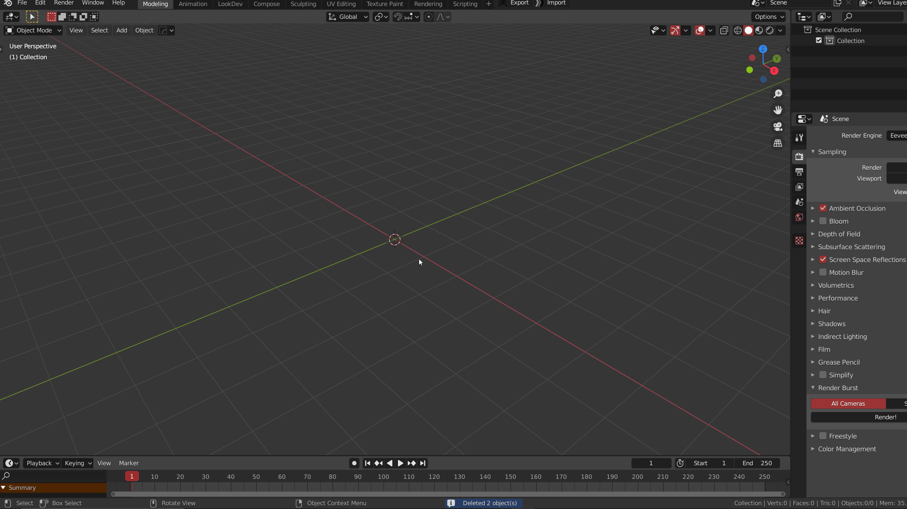

Add camera directly to view angle, with a redo panel which can quickly adjust to ortho camera, inherit previous camera properties, etc

> Shortcuts- Ctrl：Ortho cam， Shift：inherit 

#### Add view cam

You can add cameras in two places

1. shift a menu
2. Object mode  **"F"**

#### Redo Panel

Redon Panel can

* Set the position of the current camera, adjust the panel after leaving the camera's view, then the camera will move to the view position.
* Focal length, ortho, ortho scale, use name

> The following operation: press and hold **Ctrl** to add an ortho camera, and then use the  **redo panel** to adjust the general properties of the camera

#### Inherite attribute

Inherit the focal length of the **camera added last** *and other attributes* on the redo panel, excluding independent attributes

> The following operation: add a camera to the whole view, adjust it to orthogonal camera and reduce the orthogonal scale
>
>
> Then add the adjusted camera with the **same attribute** to other views

&nbsp;

&nbsp;

&nbsp;