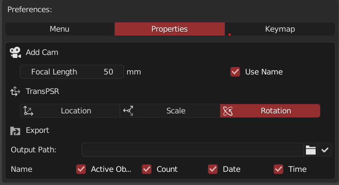

It is used to quickly export objects in the scene. The name of exported objects can be defined by time, date, active item name and selection quantity

#### Preference

The output path is **the location of the blend file used by the current window by default ** *the blend file needs to be saved*

> You can use the custom path by checking the **√** after the folder icon, then click the folder icon to select the path

#### Default export situation

 `pick.blend`  is an example

The name of the exported **obj ** file is `pick_0_Sphere_08-10_14_45.Obj` *MTL  file information is the same*

 name：`filename_count_activename_month-day_hour-min.format`

You can output the required file name by checking the required name by user

>  If the custom path is used, the `filename_export`  will be created under the path folder