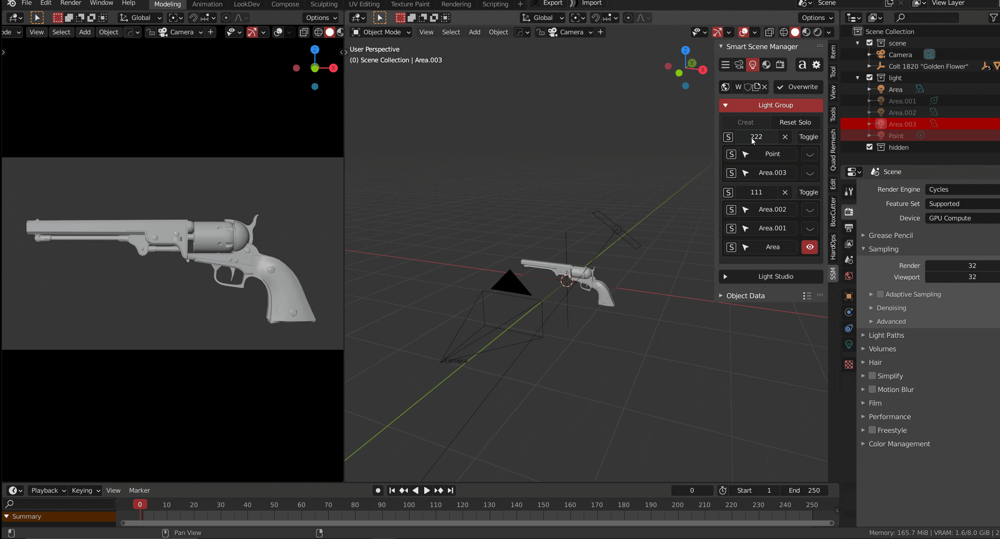

适用于灯光的独立属性，可以用于将灯光编组进行组solo，组内solo

> **0.19**版本中，已经把渲染显示和视窗显示合并

#### 组创建，灯组solo，组内solo

有三种创建组的方式：

+ 选中灯后右键菜单
+ 在N面板灯光面板中的light group 中创建
+ 选中灯光，在ssm的物体信息面板的群组中填入组的名字

> 点击 S 按钮即可进行灯组solo 或者 组solo，toggle用于关闭或者开启整组灯光

#### 组重命名，组移动，组排除，组删除

> 选中灯后，可以通过修改灯属性  *于物体信息面板中*   或**选中后重新创建**来把灯移动到其他组
>
> 可以使用集合来配合灯组，排除暂且不需要的灯来节省空间
>

