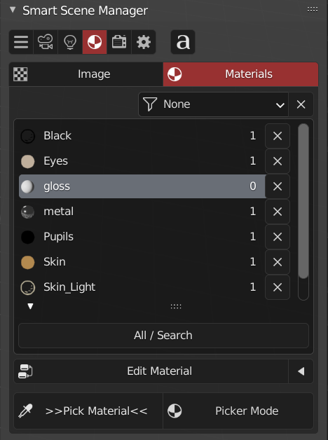
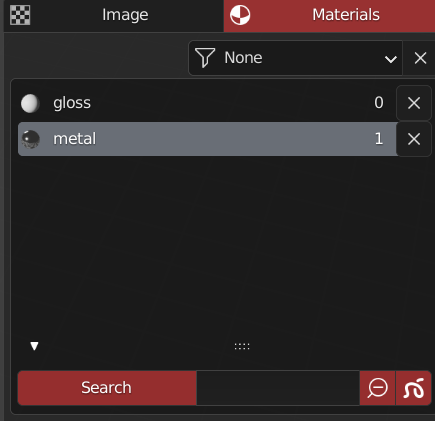
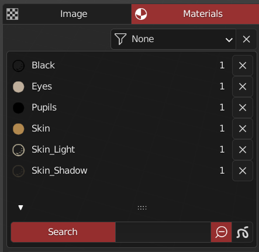
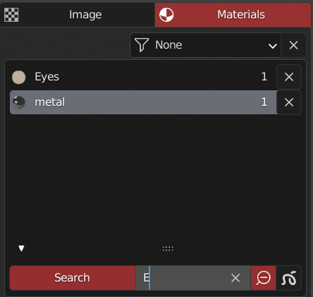
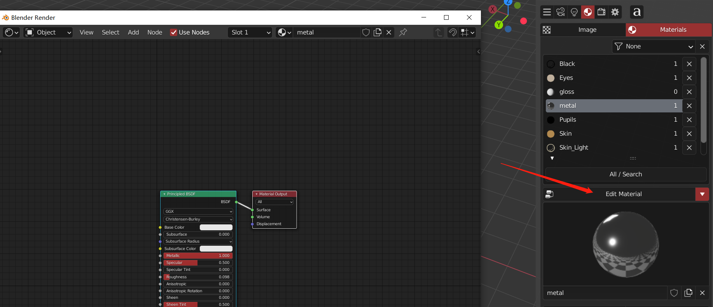

管理当前场景中材质的列表 (含Gp材质)

#### 材质管理

> 顶部过滤图标为滤项删除，可以删除伪用户材质，或者是删除未使用材质
> 双击可重命名列表选中材质，数字代表当前材质使用数量（用户数量）
> x可以彻底删除材质

> 可以进行搜索和gp/普通材质排除，搜索优先度高于排除

+ 排除了Gp材质/普通材质
    + 
    + 

+ 此图使用搜索功能，无视排除按钮
    + 

#### 当前活动材质

> 可以观察活动材质预览 点击显示节点编辑器
> 点击预览图标可更改材质

