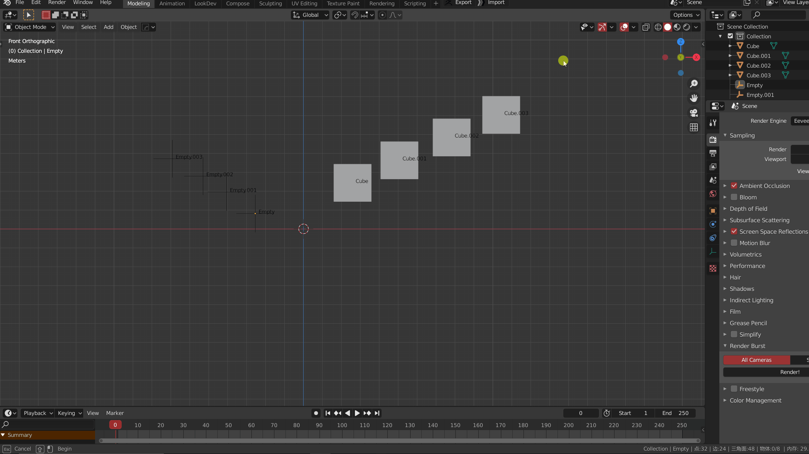
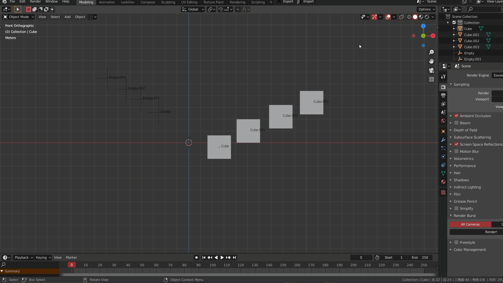
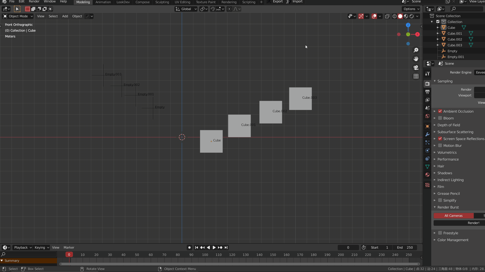

多种的对齐地面（激活项）方式，配合位置转移功能能有较大的作用

### 对齐原则

> 非网格物体对齐点：自己的原点 
>
> 网格物体对齐点：世界z轴向上的最高点或最低点 

#### 对齐1：全部的最低点 > 世界地面

大多数时候会使用到的方法，可以保持所选物体**结构的完整性**

> 选择单个物体时候，将以单个物体对齐点为最低点
>
> 选择多个物体时候，将以多个物体的里最低的对齐点为最低点 （**网格物体优先**）

#### 对齐2：全部 > 世界地面

> 按住 Ctrl 点击对齐按钮

#### 对齐3：全部 > 激活项

> 按住 Shift 点击对齐按钮

#### 对齐设置：全部（排除非网格）

勾选上之后，对非网格物体的移动不起作用，但仍可以作为对齐的目标

> 可以和以上三种方式配合使用

***
更加完整的对齐功能正在思考中