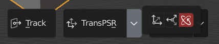

用于快速对齐位置，在小巧的PSR(位置缩放旋转)下拉菜单下，可以随心所欲地调整转移的属性

> 从左到右分别代表：位置，缩放，旋转

#### 示例1

图中线框正方体为**激活项**，场景中有且只有一个

蓝色正方体为**选择项**，场景中可有多个，现缩放＜1，位置，旋转都不为0

> 现使用以下设置(位置，旋转)，点击**转移按钮**

> 转移情况

#### 示例2

现激活项为小正方体，选择项为大正方体

> 现使用以下设置(旋转)，点击**转移按钮**

> 转移情况

