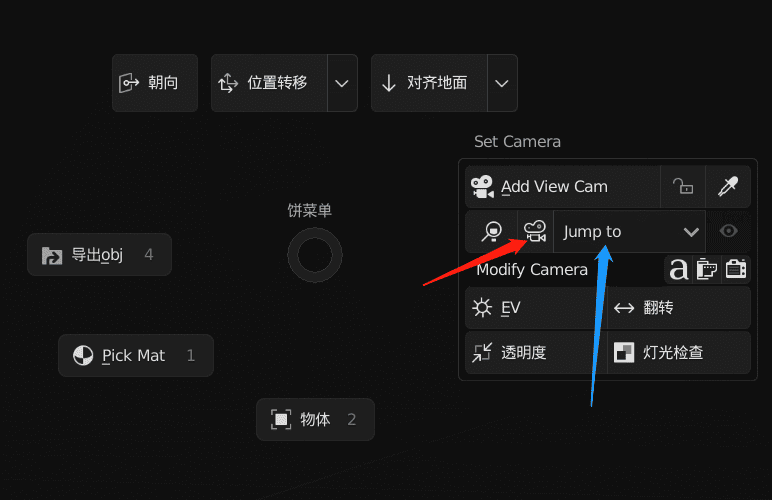
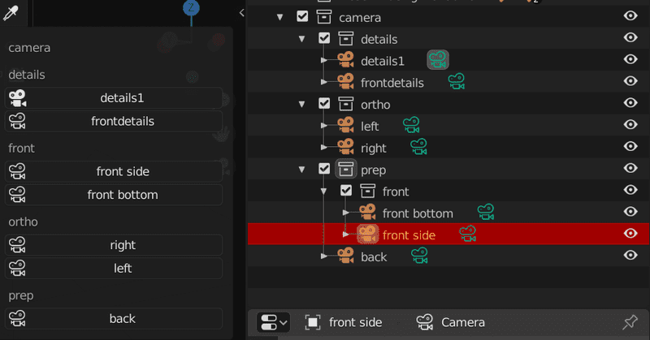

Jump and read camera independent properties (resolution, exposure)

> There are two ways to jump: view selection jump and  jump from camera panel
>
>
> Red: view selection jump; blue: camera jump panel

{: width="772" height="500"}

#### View Selection Jump

View selection jump allows two choices, namely  **activate item jump**  and  **box select jump** a

After selecting the camera, click the outline camera button to jump

{: width="2400" height="1350"}

> Texture Model from：&nbsp;[Lucile Gonzalez](https://sketchfab.com/lucilegonzalez)&nbsp;

#### &nbsp;

#### Jump From Camera Panel

According to the collection of the camera, it can be classified and displayed. Click to jump

> The camera is in the closest parent collection
>
> In the jump panel, the white camera represents the current scene camera and the outline camera represents other cameras

{: width="800" height="419"}

> Jump camera will read the camera's independent properties (resolution read shown)

{: width="2400" height="1350"}