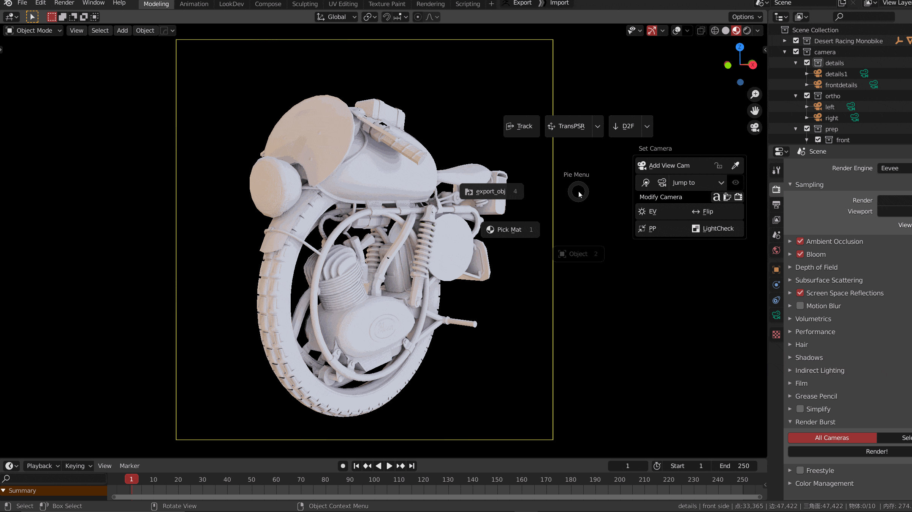

Dynamic screen flip operator, used to quickly check the picture structure

> Click to enter flip mode
>
> Use 1,2,3 or X, y, Z to flip, left click to confirm, right click to cancel
>
> The bottom left corner is the tip of flipping state 

