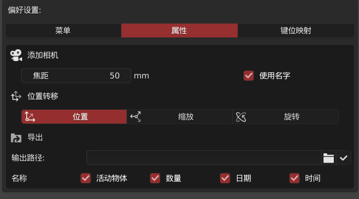
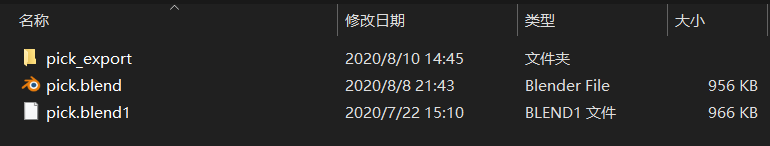

Use ChatApp on most of your Apple devices. Only the latest versions are supported.

用于快速导出场景中的物体，可用时间，日期，活动项名字，选择数量来定义导出物体名字

#### 偏好设置

输出路径默认是 **当前窗口使用的blend文件所在的位置** *blend文件需要保存*

> 可以通过勾上文件夹图标后的 **√** 来使用自定义路径，点击文件夹图标来选择路径

#### 默认导出情况

以 `pick.blend` 文件为例子

导出的**obj**文件名字为 `pick_0_Sphere_08-10_14_45.obj`  *mtl材质文件信息同理*

即 `文件名字_选择物体数量_激活项名字_月-日_小时-分钟.格式`

通过自定义勾选需要的名称，可以输出需要的文件名字

>  使用自定义路径则在路径下创建 `文件名字_export` 的文件夹