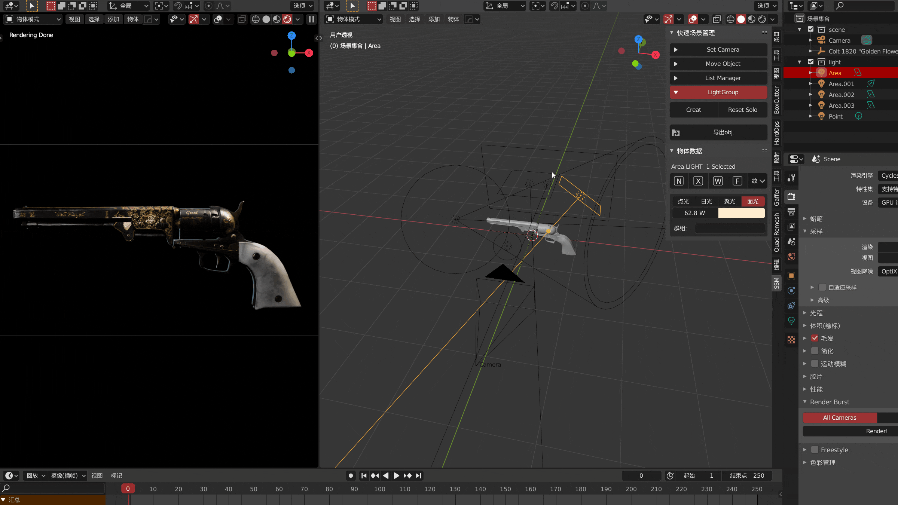
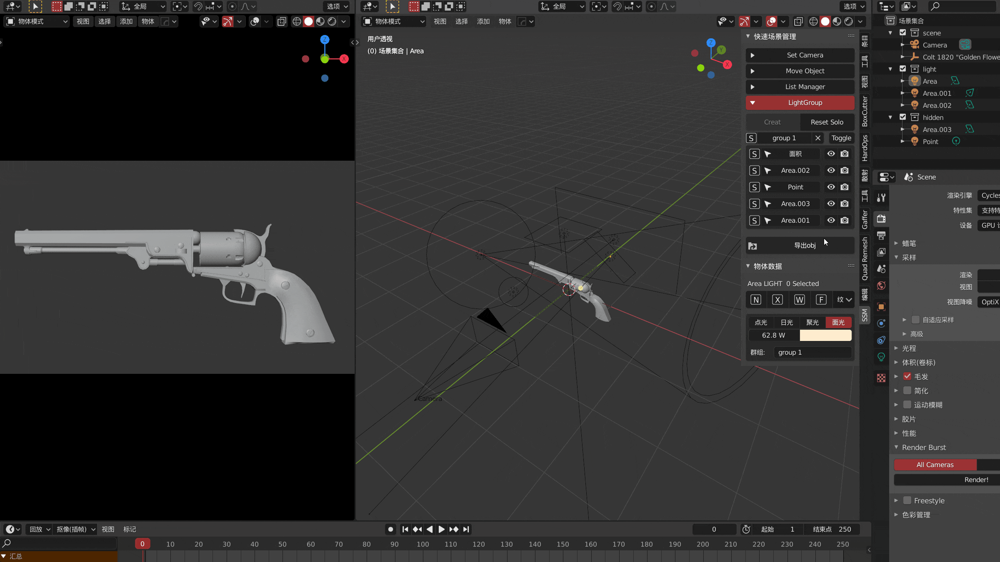

适用于灯光的独立属性，可以用于将灯光编组进行组solo，组内solo

#### 组创建，灯组solo，组内solo

> 点击 S 按钮即可进行灯组solo 或者 组solo，toggle用于关闭或者开启整组灯光

#### 组重命名，组移动，组排除，组删除

> 选中灯后，可以通过修改灯属性  *于物体信息面板中*   来把灯移动到其他组
>
> 可以使用集合来配合灯组，排除暂且不需要的灯来节省空间
>
> **删除组**前，请使用 reset solo ，否则灯光会保持组solo时状态

