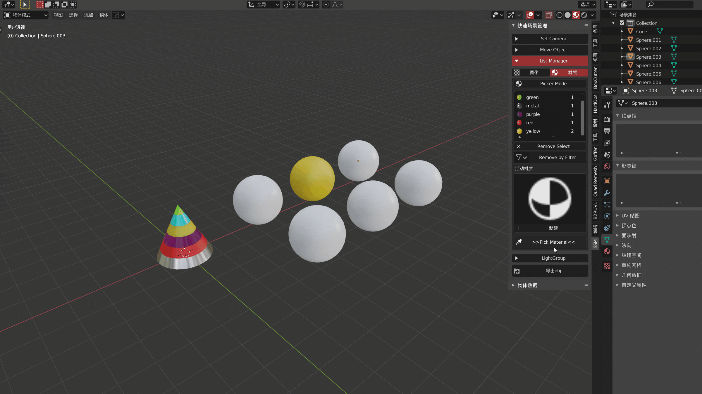

title: 动态材质拾取
category: Extra
order: 2

这是一种非常高效的，游戏化的材质管理方式，材质拾取从未如此轻松

点击Pick Mat *饼菜单或侧边菜单栏* 进入动态材质拾取模式

同时的List Manager 也会变成 **材质拾取模式** 的列表

#### 拾取，切换，清除

> 左键拾取材质 / Q,E 上下切换槽位材质 / D 移除当前槽位 / C 清除所有槽位
>
> 右键完成或者取消，最后停留位置即为活动项材质，显示于节点编辑器
>
> （若勾选偏好中的弹窗则在结束后弹窗显示活动项材质）

#### 应用，删除

> A应用当前槽位材质 / X清除当前区域材质
>

#### 非拾取模式下的拾取列表管理

> 可以用小按钮删除列表材质
>增加按钮仅对当前物体活动材质生效
>

