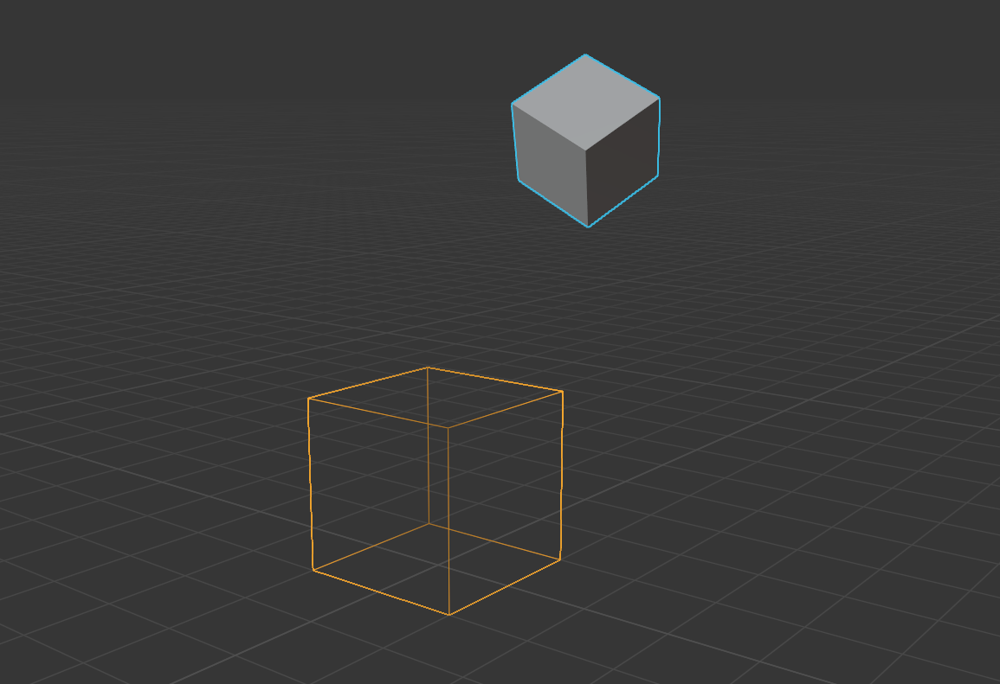
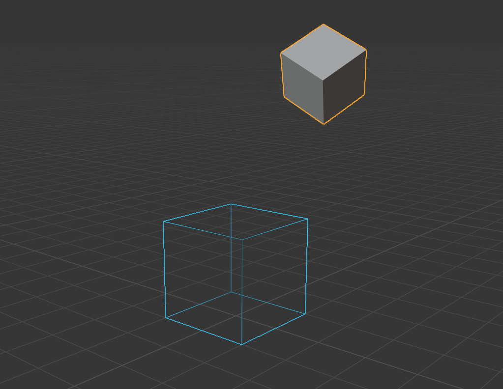

For quick alignment of positions, you can adjust the transfer properties as you like under the compact PSR drop-down menu (position scaling and rotation) 

> From left to right represent: position, scale, rotation

#### Example 1

In the figure, the cube shows in wireframe is the **active item **, which is the only one in the scene

cube with blue outline is the**selected**，which can be more than one in the scene ，Now scale < 1, position, rotation are not 0

> Now use the following settings (position, rotation), and click the **transfer button**

> Transfer situation

#### Example 2

now the small cube is active, and the bigger one is selected

> Now use the following settings (rotation), and click the **transfer button**

> Transfer situation

