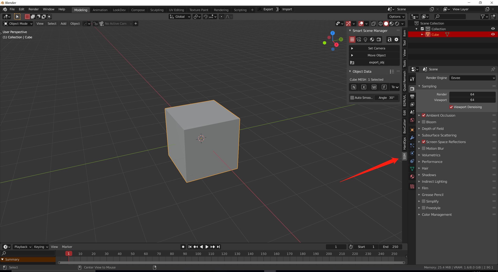
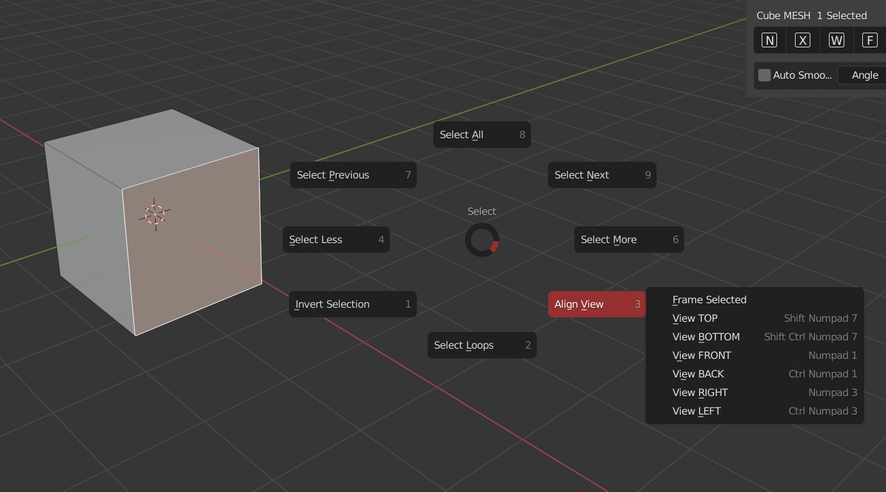

#### Addon Infomation

Addon version：0.15 Blender version required：2.83 +  Install：just install the zip file in preference windows

#### Preference

##### Menu

* The sidebar menu panel will appear in the **edit** tab, but you can also fill in the position you want*it is closed by default*{: width="800" height="543"}*

* The object information panel shows when **select object** and display the common options *(mesh, subdivision modifier, camera, curve, light)*
* Pie Menu{: width="800" height="493"}

  > If the button is gray, it indicates that the use conditions are not met. Try to select the object or add the corresponding type of object
  >
  >
  > arrow：translate 
* Pop up window for material picking 

##### Keymaps

* **F** SSM pie menu（Object mode）{: width="688" height="199"}
* **A** select mode（edit mode）{: width="800" height="503"}

&nbsp;

&nbsp;

&nbsp;