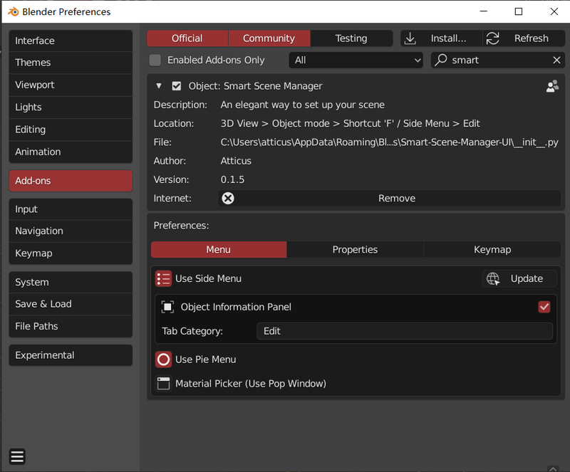
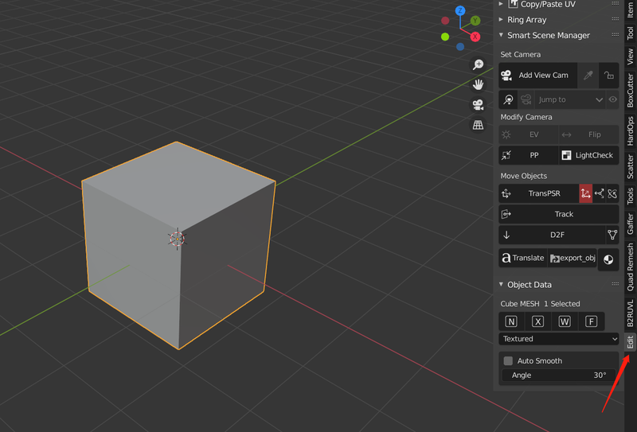
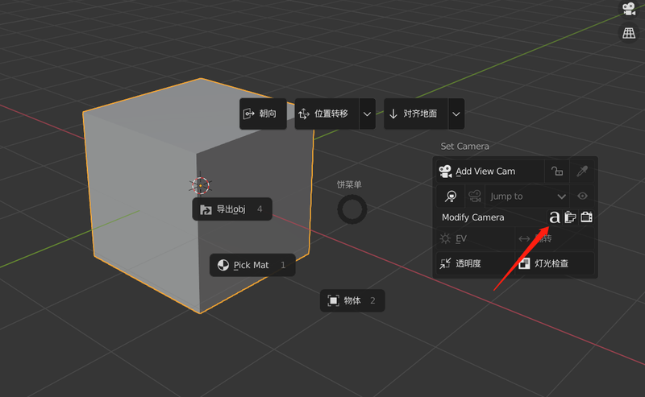
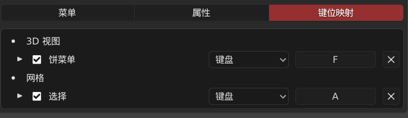
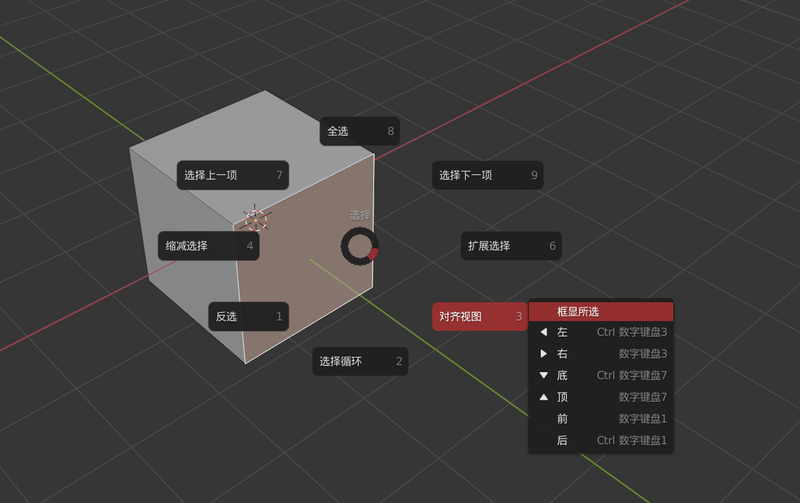

#### 基本信息

插件版本：0.15 版本要求：2.83或更高(2.83以下版本会出现菜单丢失的问题) 安装方式：直接在偏好设置中点击安装，选中压缩包即可

#### 偏好设置

> 包括偏好设置，侧栏菜单，饼菜单，工具提示等基本完成汉化

{: width="800" height="663"}

##### 菜单

* 侧边栏菜单面板，将会在**编辑**选项卡中出现，但也可以填入自己想要的位置 *默认关闭{: width="800" height="543"}*

* 物体信息面板将在**选中物体**的时候开启，显示常用选项 *(网格，细分修改器，相机，曲线，灯光 )*
* 饼菜单默认会开启三个面板,可以在偏好设置关闭相应面板 {: width="800" height="493"}

  > 若按钮呈灰色，则说明未满足使用条件，尝试选中物体或者添加对应类型物体
  >
  >
  > 箭头指向为一键翻译功能，现为中文模式
* 材质拾取弹窗（见**功能**）

##### 键位映射

* **F** SSM饼菜单（物体模式下）{: width="688" height="199"}
* **A** 选择菜单（编辑模式下）{: width="800" height="503"}

&nbsp;

&nbsp;

&nbsp;