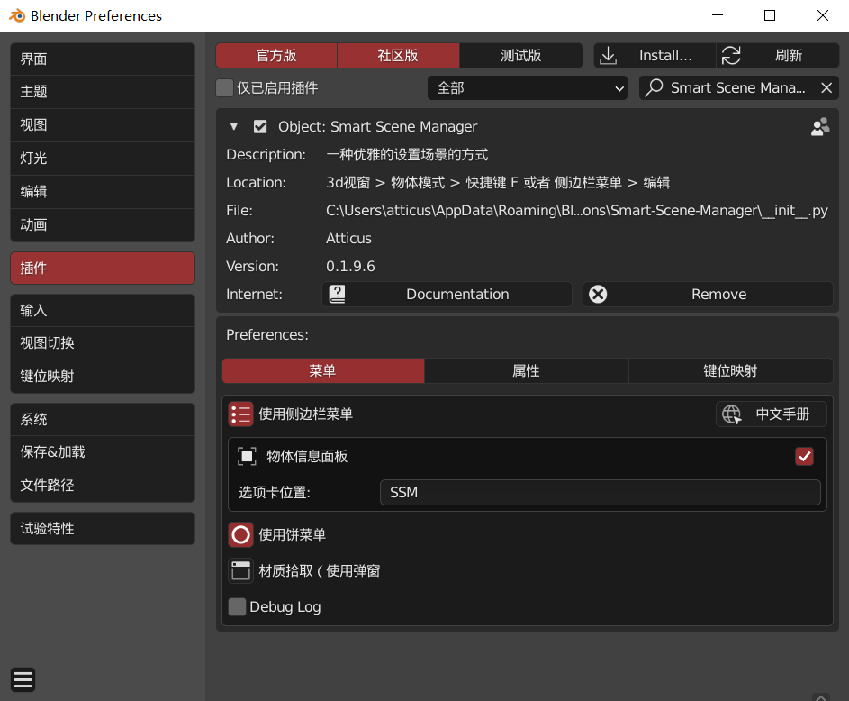
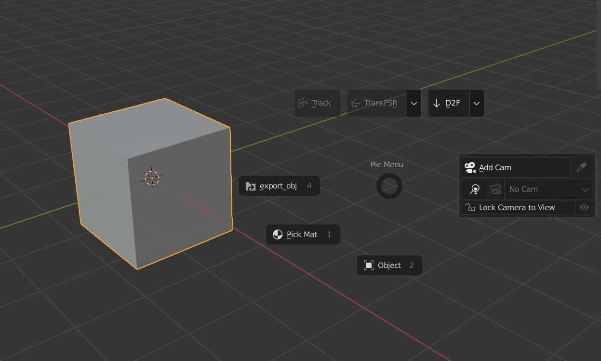

#### 基本信息

Addon_version: 0.195 
Version requirements: 2.83 or higher (the menu will be lost in the version below 2.83)
Installation method: click Install directly in the preferences, and select the compressed package

####Preferences

> Including preferences, sidebar menu, pie menu, tool tips and so on

##### 菜单

* The sidebar menu panel will appear in the * * edit * * tab, but you can also fill in the position you want * it is closed by default{: width="800" height="543"}

* The object information panel will open when ** select object** and display the common options * (mesh, subdivision modifier, camera, curve, light)*

* Pie Menu{: width="800" height="493"}

  > If the button is gray, it indicates that the use conditions are not met. Try to select the object or add the corresponding type of object

* Right click menu: when you select a camera or light, a special right-click menu will pop up!{: width="800" height="493"}

* Header Menu：for camera switch, add camera and lock cam to view{: width="800" height="493"}

* Material pick / edit material pop-up window (see **function **)

##### 键位映射

* **F** SSM pie menu (in object mode)）{: width="688" height="199"}
* **A** select menu (in edit mode){: width="800" height="503"}

&nbsp;

&nbsp;

&nbsp;