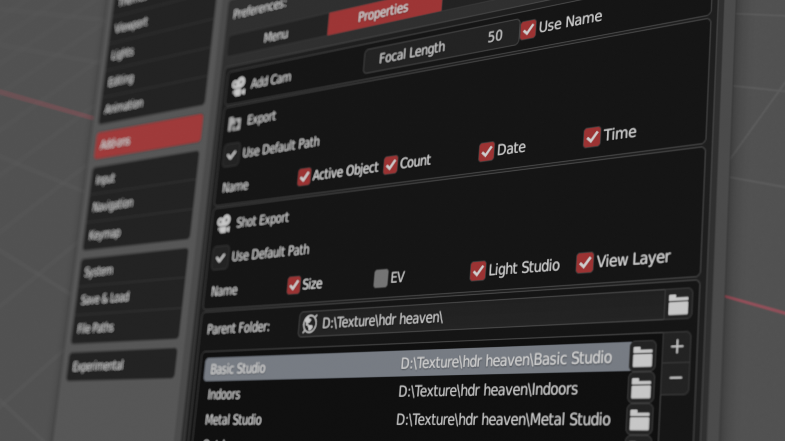

****

> **SSM工具** 是一款 用于快速管理场景的blender插件

相比于其他更加强大或者专一的插件，SSM本身的定位更加融合，他可以以一种优雅的方式，让使用者更加关注设计过程本身，而非沉浸在各种快捷键操作的衔接当中。

可以在[这里](https://github.com/atticus-lv/Smart-Scene-Manager_Free)获取免费的版本，但和付费版相差三个以上大版本

### 0.197（开发中） 版本介绍

+ 功能
    + 动态焦距调整
    + 自动曝光矫正
    + 材质管理器支持排除gp材质，支持模糊搜索
    
+ UI
    + 右键菜单
    + 更好的相机跳转面板
    + 更好的物体信息面板（对各个物体进行优化）
    + 更好的侧面板/饼菜单UI

+ 错误修复

### 本手册网站的使用方法

1. 点击左侧面板查看不同功能，可从快速上手看起
2. 所有动图都是2k分辨率的高清动图，可右键至新标签页观看
3. 如需购买本插件，可于淘宝(只剩一瓶辣椒酱)，[Gumroad](https://gumroad.com/l/smartscenemanager)，[Blendermarket](https://blendermarket.com/products/smart-scene-manger) 上购买，qq群持续维护和更新

